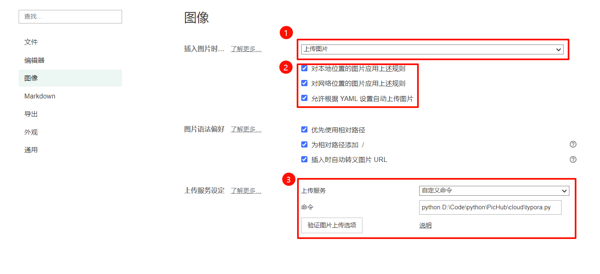
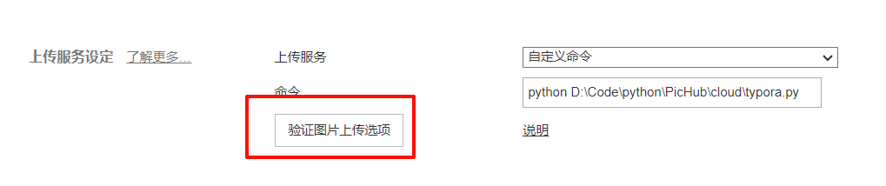
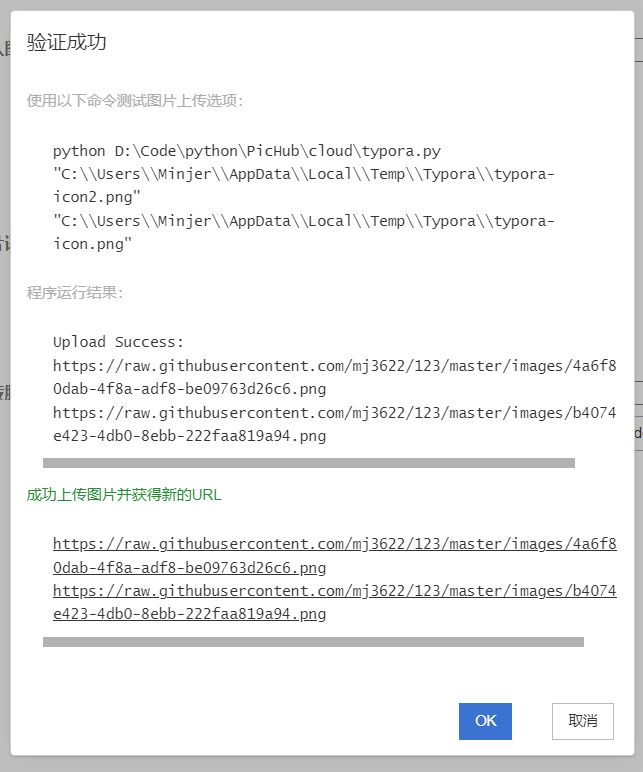

# 在Typora中使用PicHub

## 1. 前期准备
在接入Typora之前，请先详细阅读[PicHub使用手册](./使用手册.md)，并且**成功进行**一次图片上传，以确保PicHub能够正常运行


## 2. 配置Typora

打开Typora之后，进入`文件 - 偏好设置 - 图像`配置页面，如下图所示 

1. 切换`插入图片时`配置为`上传图片`

2. 按自己需求勾选应用规则（**允许自动上传必须勾选**）

3. 上传服务选择`自定义命令，填入自定义指令，将python文件路径替换为本地路径

   ```sh
   python <PicHub项目路径>/cloud/typora.py
   ```

   




## 3. 测试使用

点击验证图片上传选项




若出现如下所示页面，表示测试成功，可以正常进行使用


