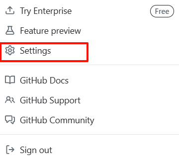
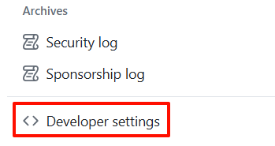

# 如何获取Github的token

为了使用[GitHub API](https://docs.github.com/en/rest/quickstart?apiVersion=2022-11-28)，我们需要先获取到Personal access tokens进行授。下面，本文将简要介绍如何获取token。

---

## 1. 进入token管理页面

**方法一：**

直接进入[Personal Access Tokens (github.com)](https://github.com/settings/tokens)页面，如下所示

**方法二：**

1. 进入Github设置页面

2. 在侧边栏中找到Developer settings，点击进入

3. 在侧边栏中找到Token（classic），点击进入

   

## 2. 生成token

点击Generate new token，进入Generae new token（classic）页面

为了使用图床功能，在选择权限时，**务必勾选**`repo`和`admin:ssh_signing_key`两个选项。考虑到安全性，可自行配置token的有效期

在完成相关配置之后，点击Generate token即可生成

## 3. 查看token

在完成上述步骤后，返回token管理页面，即可看到我们刚刚生成的token

